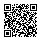

# Motivation

::: incremental

- Proof assistants use strong foundations (HOL, CIC, choice, quotients).
- Most theorems need far less.
- Costs of strength:
  - Huge tactic space -> harder search.
  - Loss of computational content (e.g., `noncomputable`).
- Reverse mathematics seeks to determine which axioms are actually needed
- **Aim:** formalize theorems in the weakest adequate system.
:::

::: notes
One of my first questions while learning Rocq and getting stuck in a proof: is there a list of **all** the things I can try right now?
:::

# Bounded arithmetic
Bounded arithmetic studies some of the weakest arithmetical theories. Here, we will consider $I\Delta_0, V^0$.

. . .

At the bottom:

\pause

::: incremental
- you are not able to prove the Pigeonhole Principle ($V^0 \nvdash PHP$)
- nor that the exponential function is total! ($I\Delta_0 \nvdash \forall x \exists!y\; \exp(x, y)$)
:::
\pause
You need to explicitly add strength, then can:

. . .

::: incremental
- prove properties of binary addition ($I\Delta_0 \vdash \forall x \forall y \; x + y = y + x$)
- define a sorting function
- prove standard graph theorems.
:::

# The goals of this presentation
1. Why formalize arithmetic?

These theories correspond nicely to complexity classes.

We want to formalize theorems of the form $I\Delta_0 \vdash \phi(x, y)$ to explore computational contents of the proofs.

2. Demonstrate that it is possible to formalize it

# The syntax of our theory: what it "$\phi(x, y)$"? Vocabulary
First, this is our vocabulary (think of them just as some UTF8 symbols, no meaning at all):

::: incremental
- variable names ($x, y, z, \dots$)  
- logical connectives ($\neg, \land, \lor$) and constants ($\bot, \top$)  
- quantifiers ($\forall, \exists$)  
- parentheses  
- **function symbols**:  
    - zero-ary: $0$, $1$,
    - binary: addition ($+$), multiplication ($\cdot$)
- **relation symbols**:  
    - binary: $=$, $\leq$
:::
\pause

Technicality: require the $=$ symbol be the *actual* equality on underlying objects. Will skip equality axioms later.

# The syntax of our theory: what it "$\phi(x, y)$"? Terms and formulas
Terms:  

::: incremental
- every variable is a term  
- $0, 1$ are terms  
- if $t_1, t_2$ are terms, then $t_1 + t_2$ and $t_1 \cdot t_2$ are terms.  
:::

. . .

Formulas:  

::: incremental
- $\bot, \top$ are formulas  
- if $t_1, t_2$ are terms, then $t_1 \leqslant t_2$, $t_1 = t_2$ are formulas  
- if $A, B$ are formulas, so are $A \land B, A \lor B, \neg A$.  
- if $A$ is a formula and $x$ is a variable, then $\forall x A$, $\exists x A$ are formulas  
:::

# The deduction system: what is "$\vdash$" in "$I\Delta_0 \vdash \phi(x, y)$"?
We use any standard deduction system for **classical**, **first-order** logic.

::: incremental
- disjunction introduction: $A \vdash A \lor B$ (from a proof of $A$ you can derive a proof of $A \lor B$)
- $\exists$ introduction: $\phi(a) \vdash \exists x, \phi(x)$  (technical restrictions on $a$ needed)  
- double negation elimination: $\neg \neg A \vdash A$ (prove $A$ from $\neg \neg A$)  
- implication elimination (*modus ponens*): $A \to B, A \vdash B$
- \dots
:::

\pause
Syntactic sugar: $A \to B := \neg A \lor B$.

# The axioms: what is $I\Delta_0$? 1-BASIC axioms
Table: 1-BASIC axioms

| Axiom | Statement |
|------:|-----------|
| **B1.** | $x + 1 \neq 0$ |
| **B2.** | $x + 1 = y + 1 \implies x = y$ |
| **B3.** | $x + 0 = x$ |
| **B4.** | $x + (y + 1) = (x + y) + 1$ |
| **B5.** | $x \cdot 0 = 0$ |
| **B6.** | $x \cdot (y + 1) = (x \cdot y) + x$ |
| **B7.** | $(x \le y \land y \le x) \implies x = y$ |
| **B8.** | $x \le x + y$ |
| **C.**  | $0 + 1 = 1$ |

# What can we prove so far?
Not much!
\pause
\begin{itemize}
\item<+-> Can we prove that addition is commutative? \uncover<+->{\textcolor{red}{\Large NO!}}
\item<+-> Can we prove that addition is associative? \uncover<+->{\textcolor{red}{\Large NO!}}
\end{itemize}
<!-- \item<+-> Can we prove that $x \leq x$? \uncover<+->{\textcolor{red}{\Large NO!}}
\item<+-> Can we prove that $0 \leq x$? \uncover<+->{\textcolor{red}{\Large NO!}} -->

# Axiom schema of induction
**Definition (Induction Scheme).**  
If $\Phi$ is a set of formulas, then $\Phi$-IND axioms are the formulas
$$
\bigl(\varphi(0)\ \land\ \forall x\,(\varphi(x)\to \varphi(x+1))\bigr)\ \to\ \forall z\,\varphi(z),
$$
where $\varphi\in\Phi$. $\varphi(x)$ may have free variables other than $x$.

\pause

The theory having axioms **B1**-**B8**, together with induction for arbitrary formulas from our vocabulary, *is* the **Peano** arithmetic (a very strong system).

\pause

By carefully controling $\Phi$, we obtain **interesting** theories.

# Complexity of formulas
**Definition (Bounded Quantifiers).**  
$$
\exists x \le t\, A \;:=\; \exists x\, (x \le t \land A)
$$
$$
\forall x \le t\, A \;:=\; \forall x\, (x \le t \to A)
$$
(the variable $x$ must not occur in the term $t$)  
Quantifier that occur in this form are **bounded**.  

. . .


A formula is $\Delta_0$ (**bounded**) if every quantifier in it is bounded.  
A formula is $\Sigma_1$ if it is of the form  $\exists x_1, \dots, \exists x_k \phi$ and $\phi$ is bounded.

# Case 2: $\Phi$ = $\Delta_0$
1-BASIC axioms together with induction for bounded formulas only give us a well-studied system called $I\Delta_0$.

The following formulas (and their universal closures) are theorems of $I\Delta_0$ [@Cook_Nguyen_2010]:

::: incremental
- $x + y = y + x$  *(commutativity of $+$)*
- $(x + y) + z = x + (y + z)$  *(associativity of $+$)*
- $x \le x$
- $0 \le x$
- $\forall x\,\forall y\;\bigl(0 < x \to \exists q\,\exists r\, (\,r < x \land y = x \cdot q + r\,)\bigr)$ *(division theorem)*
:::

# Defining new functions in $I\Delta_0$
We say that a function $f(\vec x)$ is *provably total* in $I\Delta_0$ if there is a formula $\phi(\vec x, y)$ in $\Sigma_1$ (i.e. of the form $\exists \dots \exists \psi$ for $\psi$ bounded) such that:
$$I\Delta_0 \vdash \forall x \exists! y \phi(\vec x, y)$$
and that
$$y = f(\vec x) \iff \phi(\vec x, y)$$

# What functions can $I\Delta_0$ *define* and what it can't?
Examples:

\pause 

::: incremental
- the function $LimitedSub(x, y) := \max\{0, x - y\}$
- the function $x\; \text{div}\; y := \lfloor x/y \rfloor$ is defined by
$$
z = \left\lfloor x/y \right\rfloor
\;\leftrightarrow\;
\bigl( (y \cdot z \le x \land x < y(z+1)) \lor (y=0 \land z=0) \bigr).
$$
- $x \; \text{mod}\; y$
- $\lfloor \sqrt x \rfloor$
- \dots
:::

. . . 

For all of these, you need to prove existence and uniqueness of the result.

. . .

**BUT**: $I\Delta_0$ can't "prove total" the exponential function $(x \mapsto 2^x)$!  

. . .

**NOTE**: the computational content of $I\Delta_0$ is well-studied.  
**NOTE**: $I\Delta_0$ doesn't align well with practical computer science.

# Theories corresponding to complexity classes
The idea is similar.
\pause

::: incremental
- We still operate in first-order, classical logic.
- Instead of one sort, we have two:
    - `num` (representing unary numbers)
    - `str` (representing binary strings)
- Instead of induction we have finite set comprehension  
    (finite sets $\equiv$ binary strings)
:::

| Theory            | Characterizes          | Examples                                                             |
|-------------------|------------------------|----------------------------------------------------------------------|
| $\mathsf{V}^0$    | $\mathsf{FAC}^0$       | $\nvdash$ Pigeonhole; $\vdash$ properties of binary +         |
| $\mathsf{VTC}^0$  | $\mathsf{FTC}^0$       | $\vdash$ Pigeonhole; defines sorting                                         |
| $\mathsf{VL}$     | $\mathsf{FLOGSPACE}$   | $\cdots$                                                             |
| $\mathsf{V}^1$    | $\mathsf{FPTIME}$      | $\cdots$                                                             |


If time allows, we will get back to details of the definition.

# 
\centering
\Huge\bfseries How would you even formalize this field?

# Requirements on the product
*Transfer* proofs of the form $V^0 \vdash x + y = y + x$ from paper to computer.

Make "cheating" difficult or visible for the reader.

Enable easy interactive proving inside of the weak arithmetic.

# Problems to avoid
No way to express that $Prop$ is $\Delta_0$ or $\Sigma_1$ in any of the existing systems.  
Rocq, Lean and Isabelle/Pure all don't foster a shallow embedding.  

```
inductive Formula
| false : Formula
| eq (term1 term2 : Term) : Formula
| implies (f1 f2 : Formula) : Formula
```

Defining a proof system from scratch can take years of works to become usable

# The 90% solution
```haskell
class IOPENModel (M : Type _) where
  num : Type*
  B1 : num.realizes B1_statement
  B2 : num.realizes B2_statement
  open_induction (phi: Formula) :
    phi.IsOpen -> num.realizes (makeInduction phi)

theorem add_assoc (M : IOPENModel)
  : forall x y z : M.num, (x + y) + z = x + (y + z) := by
  have ind := M.open_induction $
    ((x' +' y') + z') =' (x' + (y' + z'))
  -- simps of axioms
  intro x y z
```
Another design will be necessary for proof-theoretical results

# What's formalized?
- the $I\Delta_0$ theory and the two-sorted $V^0$ theory
- basic properties of the $I\Delta_0$ system  
  proofs by induction on a $\Delta_0$ formula
- partial proof of $V^0 \vdash MIN$, first step towards obtaining induction in $V^0$

# How it looks like?
```haskell
intro x
  apply ind
  · intro a ha ha'
    exists a
    constructor
    · apply b8
    · rfl
```


# Thanks!

<!-- qrencode -o github-qr.svg "https://github.com/ruplet/formalization-of-bounded-arithmetic" -t SVG -->
[https://github.com/ruplet/formalization-of-bounded-arithmetic](https://github.com/ruplet/formalization-of-bounded-arithmetic)


# Bonus: finite axiomatizability of $V^0$
The theory $V^0$ is finitely axiomatizable[@Cook_Nguyen_2010].

You don't need an induction axiom scheme, nor a comprehension axiom scheme.
The instantiations of induction to around 20 formulas and of comprehension to 12 formulas suffice.

Moreover, since the theories $VC$ expressing complexity classes $C$ are constructed from axioms of $V^0$ + a complete problem for $C$ taken as an axiom. So they are also finitely axiomatizable and (very) expressive.

Perhaps $V^0$ is a good theory for automated proof search. I haven't managed to explore this direction yet.


# $V^0$ definition: 2-BASIC axioms
Two sorts: unary numbers ($x, y, z, \dots$), binary strings ($X, Y, Z, \dots$).  

Symbols: $L^2_A = [0, 1, +, \cdot, \text{len}, =_{num}, =_{str}, \leq, \in]$.

\begin{table}
\centering
\begin{tabular}{@{}p{0.48\linewidth} p{0.48\linewidth}@{}}
\textbf{B1.} $x + 1 \ne 0$ & \textbf{B2.} $x + 1 = y + 1 \to x = y$ \\
\textbf{B3.} $x + 0 = x$ & \textbf{B4.} $x + (y + 1) = (x + y) + 1$ \\
\textbf{B5.} $x \cdot 0 = 0$ & \textbf{B6.} $x \cdot (y + 1) = (x \cdot y) + x$ \\
\textbf{B7.} $(x \le y \land y \le x) \to x = y$ & \textbf{B8.} $x \le x + y$ \\
\textbf{B9.} $0 \le x$ & \textbf{B10.} $x \le y \lor y \le x$ \\
\textbf{B11.} $x \le y \leftrightarrow x < y + 1$ & \textbf{B12.} $x \ne 0 \to \exists y \le x\,(y + 1 = x)$ \\
\textbf{L1.} $X(y) \to y < \lvert X\rvert$ & \textbf{L2.} $y + 1 = \lvert X\rvert \to X(y)$ \\
\multicolumn{2}{@{}p{\linewidth}@{}}{\textbf{SE.}\quad $\bigl(\lvert X\rvert = \lvert Y\rvert \land \forall i < \lvert X\rvert\, (X(i) \leftrightarrow Y(i))\bigr) \to X = Y$} \\
\end{tabular}
\end{table}


---

Notation: $\exists X \leqslant y \phi := \exists X (|X| \leqslant y \land \phi)$.

**Definition (Comprehension Axiom).**  
If $\Phi$ is a set of formulas, the comprehension scheme for $\Phi$ (denoted $\Phi$-COMP) consists of all instances
$$
\exists X \le y\;\forall z < y\;\bigl(X(z) \leftrightarrow \varphi(z)\bigr),
$$
where $\varphi(z)\in\Phi$ and $X$ does not occur free in $\varphi(z)$.  
Here $\varphi(z)$ may have additional free variables of either sort besides $z$.

**Definition ($V_i$).**  
For $i \ge 0$, the theory $V_i$ has vocabulary $L^2_A$ and is axiomatized by **2-BASIC** together with $\Sigma^B_i$-COMP.

# Bibliography
- Jiatu Li's introduction from 1st July 2025:  
[https://eccc.weizmann.ac.il/report/2025/086/](https://eccc.weizmann.ac.il/report/2025/086/)  

::: {#refs}
:::