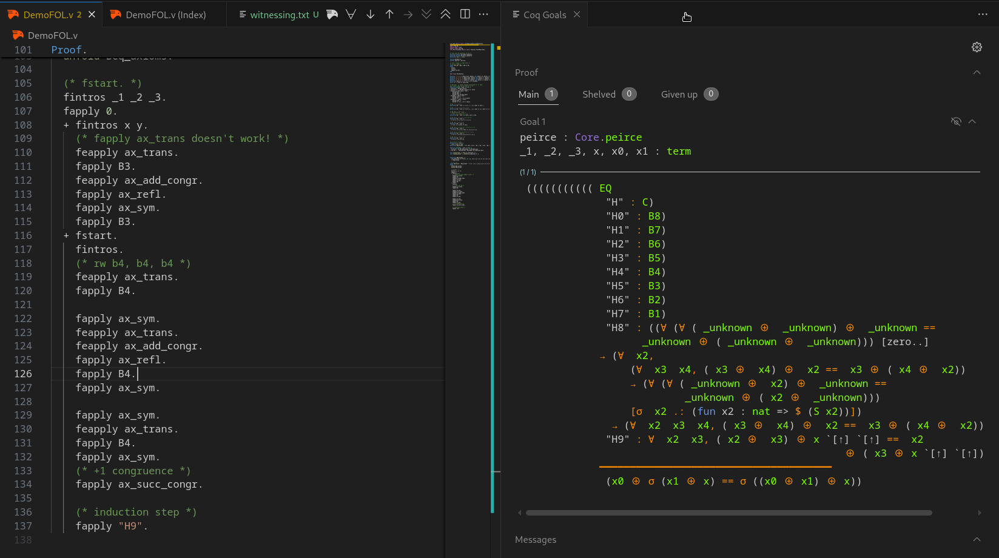

# Motivation

::: incremental

- Proof assistants use strong foundations (HOL, CIC, choice, quotients).
- Most theorems need far less.
- Costs of strength:
  - Huge tactic space -> harder search.
  - Loss of computational content (e.g., `noncomputable`).
- Reverse mathematics seeks to determine which axioms are actually needed
- **Aim:** formalize theorems in the weakest adequate system.
:::

::: notes
One of my first questions while learning Rocq and getting stuck in a proof: is there a list of **all** the things I can try right now?
:::

# Bounded arithmetic
Bounded arithmetic studies some of the weakest arithmetical theories. Here, we will consider $I\Delta_0, V^0$.

. . .

At the bottom:

\pause

::: incremental
- you are not able to prove the Pigeonhole Principle ($V^0 \nvdash PHP$)
- nor that the exponential function is total! ($I\Delta_0 \nvdash \forall x \exists!y\; \exp(x, y)$)
:::
\pause
You need to explicitly add strength, then you can:

. . .

::: incremental
- prove properties of binary addition ($I\Delta_0 \vdash \forall x \forall y \; x + y = y + x$)
- define a sorting function
- prove standard graph theorems.
:::

# The goals of this presentation
1. Why formalize arithmetic?

These theories correspond nicely to complexity classes.

We want to formalize theorems of the form $I\Delta_0 \vdash \phi(x, y)$ to explore computational content of the proofs.

2. Demonstrate that formalizing it is possible.

# The syntax of our theory: what it "$\phi(x, y)$"? Vocabulary
First, this is our vocabulary (think of them just as some UTF8 symbols, no meaning at all):

::: incremental
- variable names ($x, y, z, \dots$)  
- logical connectives ($\neg, \land, \lor$) and constants ($\bot, \top$)  
- quantifiers ($\forall, \exists$)  
- parentheses  
- **function symbols**:  
    - zero-ary: $0$, $1$,
    - binary: addition ($+$), multiplication ($\cdot$)
- **relation symbols**:  
    - binary: $=$, $\leq$
:::
\pause

Technicality: require the $=$ symbol be the *actual* equality on underlying objects. Will skip equality axioms later.

# The syntax of our theory: what it "$\phi(x, y)$"? Terms and formulas
Terms:  

::: incremental
- every variable is a term  
- $0, 1$ are terms  
- if $t_1, t_2$ are terms, then $t_1 + t_2$ and $t_1 \cdot t_2$ are terms.  
:::

. . .

Formulas:  

::: incremental
- $\bot, \top$ are formulas  
- if $t_1, t_2$ are terms, then $t_1 \leqslant t_2$, $t_1 = t_2$ are formulas  
- if $A, B$ are formulas, so are $A \land B, A \lor B, \neg A$.  
- if $A$ is a formula and $x$ is a variable, then $\forall x A$, $\exists x A$ are formulas  
:::

# The deduction system: what is "$\vdash$" in "$I\Delta_0 \vdash \phi(x, y)$"?
We use any standard deduction system for **classical**, **first-order** logic.

::: incremental
- disjunction introduction: $A \vdash A \lor B$ (from a proof of $A$ you can derive a proof of $A \lor B$)
- $\exists$ introduction: $\phi(a) \vdash \exists x, \phi(x)$  (technical restrictions on $a$ needed)  
- double negation elimination: $\neg \neg A \vdash A$ (prove $A$ from $\neg \neg A$)  
- implication elimination (*modus ponens*): $A \to B, A \vdash B$
- \dots
:::

\pause
Syntactic sugar: $A \to B := \neg A \lor B$.

# The axioms: what is $I\Delta_0$? 1-BASIC axioms
Table: 1-BASIC axioms

| Axiom | Statement |
|------:|-----------|
| **B1.** | $x + 1 \neq 0$ |
| **B2.** | $x + 1 = y + 1 \implies x = y$ |
| **B3.** | $x + 0 = x$ |
| **B4.** | $x + (y + 1) = (x + y) + 1$ |
| **B5.** | $x \cdot 0 = 0$ |
| **B6.** | $x \cdot (y + 1) = (x \cdot y) + x$ |
| **B7.** | $(x \le y \land y \le x) \implies x = y$ |
| **B8.** | $x \le x + y$ |
| **C.**  | $0 + 1 = 1$ |

# What can we prove so far?
Not much!
\pause
\begin{itemize}
\item<+-> Can we prove that addition is commutative? \uncover<+->{\textcolor{red}{\Large NO!}}
\item<+-> Can we prove that addition is associative? \uncover<+->{\textcolor{red}{\Large NO!}}
\end{itemize}
<!-- \item<+-> Can we prove that $x \leq x$? \uncover<+->{\textcolor{red}{\Large NO!}}
\item<+-> Can we prove that $0 \leq x$? \uncover<+->{\textcolor{red}{\Large NO!}} -->

# Axiom schema of induction
**Definition (Induction Scheme).**  
If $\Phi$ is a set of formulas, then $\Phi$-IND axioms are the formulas
$$
\bigl(\varphi(0)\ \land\ \forall x\,(\varphi(x)\to \varphi(x+1))\bigr)\ \to\ \forall z\,\varphi(z),
$$
where $\varphi\in\Phi$. $\varphi(x)$ may have free variables other than $x$.

\pause

The theory having axioms **B1**-**B8**, together with induction for arbitrary formulas from our vocabulary, *is* the **Peano** arithmetic (a very strong system).

\pause

By carefully controlling $\Phi$, we obtain **interesting** theories.

# Complexity of formulas
**Definition (Bounded Quantifiers).**  
$$
\exists x \le t\, A \;:=\; \exists x\, (x \le t \land A)
$$
$$
\forall x \le t\, A \;:=\; \forall x\, (x \le t \to A)
$$
(the variable $x$ must not occur in the term $t$)  
Quantifier that occur in this form are **bounded**.  

. . .


A formula is $\Delta_0$ (**bounded**) if every quantifier in it is bounded.  
A formula is $\Sigma_1$ if it is of the form  $\exists x_1, \dots, \exists x_k \phi$ and $\phi$ is bounded.

# Case 2: $\Phi$ = $\Delta_0$
1-BASIC axioms together with induction for bounded formulas only give us a well-studied system called $I\Delta_0$.

The following formulas (and their universal closures) are theorems of $I\Delta_0$ [@Cook_Nguyen_2010]:

::: incremental
- $x + y = y + x$  *(commutativity of $+$)*
- $(x + y) + z = x + (y + z)$  *(associativity of $+$)*
- $x \le x$
- $0 \le x$
- $\forall x\,\forall y\;\bigl(0 < x \to \exists q\,\exists r\, (\,r < x \land y = x \cdot q + r\,)\bigr)$ *(division theorem)*
:::

# Defining new functions in $I\Delta_0$
We say that a function $f(\vec x)$ is *provably total* in $I\Delta_0$ if there is a formula $\phi(\vec x, y)$ in $\Sigma_1$ (i.e. of the form $\exists \dots \exists \psi$ for $\psi$ bounded) such that:
$$I\Delta_0 \vdash \forall x \exists! y \phi(\vec x, y)$$
and that
$$y = f(\vec x) \iff \phi(\vec x, y)$$

# What functions can $I\Delta_0$ *define* and what it can't?
Examples:

\pause 

::: incremental
- the function $LimitedSub(x, y) := \max\{0, x - y\}$
- the function $x\; \text{div}\; y := \lfloor x/y \rfloor$ is defined by
$$
z = \left\lfloor x/y \right\rfloor
\;\leftrightarrow\;
\bigl( (y \cdot z \le x \land x < y(z+1)) \lor (y=0 \land z=0) \bigr).
$$
- $x \; \text{mod}\; y$
- $\lfloor \sqrt x \rfloor$
- \dots
:::

. . . 

For all of these, you need to prove existence and uniqueness of the result.

. . .

**BUT**: $I\Delta_0$ can't "prove total" the exponential function $(x \mapsto 2^x)$!  

. . .

**NOTE**: the computational content of $I\Delta_0$ is well-studied.  
**NOTE**: $I\Delta_0$ doesn't align well with practical computer science.

# Theories corresponding to complexity classes
The idea is similar.
\pause

::: incremental
- We still operate in first-order, classical logic.
- Instead of one sort, we have two:
    - `num` (representing unary numbers)
    - `str` (representing binary strings)
- Instead of induction we have finite set comprehension  
    (finite sets $\equiv$ binary strings)
:::

| Theory            | Characterizes          | Examples                                                             |
|-------------------|------------------------|----------------------------------------------------------------------|
| $\mathsf{V}^0$    | $\mathsf{FAC}^0$       | $\nvdash$ Pigeonhole; $\vdash$ properties of binary +         |
| $\mathsf{VTC}^0$  | $\mathsf{FTC}^0$       | $\vdash$ Pigeonhole; defines sorting                                         |
| $\mathsf{VL}$     | $\mathsf{FLOGSPACE}$   | $\cdots$                                                             |
| $\mathsf{V}^1$    | $\mathsf{FPTIME}$      | $\cdots$                                                             |


If time allows, we will get back to details of the definition.

# 
\centering
\Huge\bfseries How would you even formalize this field?

# Recall: Axiom schema of induction
**Definition (Induction Scheme).**  
If $\Phi$ is a set of formulas, then $\Phi$-IND axioms are the formulas
$$
\bigl(\varphi(0)\ \land\ \forall x\,(\varphi(x)\to \varphi(x+1))\bigr)\ \to\ \forall z\,\varphi(z),
$$
where $\varphi\in\Phi$. $\varphi(x)$ may have free variables other than $x$.

\pause

The theory having axioms **B1**-**B8**, together with induction for arbitrary formulas from our vocabulary, *is* the **Peano** arithmetic (a very strong system).

\pause

By carefully controling $\Phi$, we obtain **interesting** theories.

# Approaches: obvious and wrong
Not surprisingly, there is no existing proof assistant with power limited to $I\Delta_0$. 
\pause

All mainstream proof assistants (Rocq, Lean 4, Isabelle/HOL, Agda, Mizar) have very strong theories.
If we just accept any proof in Lean 4, the user can cheat by e.g. using the axiom of choice.
\pause

Sometimes we can "switch-off" some axioms of proof assistants, but this doesn't go far enough.
E.g. we can (and shouldn't) "switch-on" "-impredicative-set" in Rocq.

# Introducing new axioms to meta-mathematical tools
- Introducing new axioms to Rocq and Lean is not considered a good practice
- We have tools designed specifically to define new theories from scratch
- Metamath, Isabelle (not Isabelle/HOL)
- In Isabelle/Pure, we can easily define our BASIC axioms (without induction). Example:
- Metamath seems to be a strictly less useful tool than Isabelle for our problem

# Isabelle/Pure
```lean
(* ===== Axioms of 2-BASIC ===== *)
axiomatization where
  (* Basic arithmetic axioms (B1-B8) *)
  (* B1. x + 1 != 0 *)
  B1: "~((x + 1) = 0)" and
  (* B2. x + 1 = y + 1 implies x = y *)
  B2: "((x + 1) = (y +1)) --> (x = y)" and
```

# Isabelle/Pure: working proof
```lean
(* Exercise 5.1.a: not x < 0 *)
lemma exercise_5_1_a: "~ (x < 0)"
proof
  assume "x < 0"
  then have "x <= 0" and "x ~= 0" by simp_all
  from B9 have "0 <= x" .
  then have "((x <= 0) \<and> (0 <= x)) --> (x = 0)"
    using B7 by blast
  then have "x = 0" using `x <= 0` `0 <= x` by blast
  with `x ~= 0` show False by contradiction
qed
```

# How to express $\Delta_0$ formulas?
- When trying to define our $\Delta_0$-induction axiom scheme, we hit a wall:
  every expression of the form $\forall x, \exists z, \phi(x, z)$ is just a (Isabelle-equivalent of) `Prop`.
- The same is true for Rocq and Lean. If we "shallowly" define a formula
  in these systems, we get an object of type `Prop` and can do strictly nothing with it.
- We need to define from scratch what it means to be a Formula.
- We have no advantage of using Isabelle for this as compared to Rocq and Lean.

# Defining Formulas: Hilbert
```lean
inductive Formula where
| var : Name -> Formula
| imp : Formula -> Formula -> Formula
deriving Repr, DecidableEq

notation:60 a " ==> " b => Formula.imp a b

def A1 (phi psi : Formula)
  := phi ==> psi ==> phi
def A2 (phi psi ksi : Formula)
  := (phi ==> psi ==> ksi) ==> (phi ==> psi) ==> phi ==> ksi
```

# Need for macros / metaprogramming
Defining formulas as 
```lean
Formula.imp (Formula.leq a b) (Formula.binOp add c d)
```
is not going to work.

A realistic formula we will want to embed:
```lean
x ≠ 0 -> (∃i y, (y <= x ∧ (y + 1) = x))
```

# Syntactical overlay over Rocq or Lean
- A good idea is to try enabling user to enter a special "proof mode",
  in which we as programmers have full control over what is allowed and what is not.
- We will define what it means to be a Formula and (perhaps) what it means to be Derivable.
- As working with objects defined this way will be a nightmare, we need to apply metaprogramming.
- Rocq syntactical metaprogramming is spread across multiple tools: `Notation` command, MetaRocq, OCaml plugins (full power).
- For tactics, we have Ltac, Ltac2, Mtac2, and also OCaml plugins.
- Lean 4 metaprogramming is done in Lean 4.

# Lean 4 metaprogramming world
- Parser reads source text and produces objects of type `Syntax`.
- We can define custom macros `Syntax -> Syntax`.
- Elaborator reads `Syntax` and produces a single typed `Expr` object.
- We can define custom elaborator rules `Syntax -> Expr`.
- The internal state of all these components is exposed through monads
- A function `f : a -> MetaM b` can introduce a new variable.
- A function `f : a -> TacticM b` can change the goal of a theorem being proved.

# Defining Derivability: Hilbert
```lean
inductive Derivable : (List Formula) -> Formula -> Prop where
| assumption {Γ} {φ} :
  (φ ∈ Γ)
  -> Derivable Γ φ
| axK {Γ} {phi psi} :
  Derivable Γ $ K phi psi
| axS {Γ} {phi psi ksi} :
  Derivable Γ $ S phi psi ksi
| mult_mp {Γ1 Γ2} {phi psi} :
  Derivable Γ2 (phi ==> psi)
  -> Derivable Γ1 phi
  -> Derivable (Γ1 ++ Γ2) psi
```

# Lean 4: Macros for Hilbert-style proof mode
```lean
-- Syntax category for Hilbert proof steps
declare_syntax_cat hilbert_tactic
syntax "have" ident ":" logic_expr "by" "assumption"
  : hilbert_tactic
syntax "have" ident ":=" "axK" logic_expr "," logic_expr
  : hilbert_tactic
syntax "have" ident ":=" "axS" ...
syntax "have" ident ":=" "mult_mp" ident ident : hilbert_tactic
syntax "exact " ident : hilbert_tactic

syntax "begin_hilbert " (hilbert_tactic)* : tactic
```

# Lean 4: Demo of Hilbert-style proof mode
After we define our custom syntax `[Logic| ..]`, transforming syntax of logical formula
into our previously defined `Formula` object, we can already get a Hilbert-style proof mode.
If the proof begins with "by begin_hilbert", there is no way to cheat.

```lean
example : Derivable [] [Logic| φ -> φ] := by
  begin_hilbert
    have a := axS φ, φ -> φ, φ
    have b := axK φ, φ -> φ
    have c := mult_mp a b
    have d := axK φ, φ
    have e := mult_mp c d
    exact e
```

# How far will we go this way?
- To make our Hilbert-proof mode usable, we would need to implement a few tactics, etc.
\pause
- But: in reality we don't prove Hilbert-style.
\pause
- To scale this approach to a proper Gentzen-style deduction system is orders of magnitude more work

# Coq Library for First-Order Logic
Luckily, someone has already done it.

```lean
Lemma add_assoc :
  BEq_axioms' ⊢ << ∀' x y z,
    (((x ⊕ y) ⊕ z) == (x ⊕ (y ⊕ z))).
Proof.
  unfold BEq_axioms'.
  unfold Beq_axioms.

  (* fstart. *)
  fintros _1 _2 _3.
  fapply 0.
  + fintros x y.
    (* fapply ax_trans doesn't work! *)
    feapply ax_trans.
```

# More control = more responsibility
This really is a deduction system written from scratch.
You have all the control over the axioms, but also there will be no more features
than you implement on your own.


# Circle back
If we can do proofs so easily without axiom schemes, we really would like to not lose this functionality.
```lean
class NatModel (num : Type)
  extends Zero num, One num, Add num, LE num where
  B3: ∀ x : num, x + 0 = x
  B8: ∀ x y : num, x <= x + y

theorem le_refl (M : Type) (h : NatModel M)
  : ∀ a : M, a <= a :=
by
  intro x
  conv => right; rw [<- h.B3 x]
  apply h.B8
```

# Mathlib ModelTheory
ModelTheory library is a byproduct of formalization of the independence of the continuum hypothesis (the Flypitch project).
Contains:

- definition of a first-order language (e.g. Peano: $0, 1, +, \cdot, \leqslant$)
- definition of logical terms, formulas in a language; substitution, variable relabeling
- definition of a formula being realized in a model

For our purposes:
```
Model.Realizes("forall x, x + 1 != 0") : Prop
Model.Realizes("forall x, x + 1 != 0") <-> forall x:Model, x + 1 != 0
```

# Adding induction scheme!
Here:

- `phi.IsOpen` traverses `Formula` recursively and ensures there are no quantifiers
- `peano.Formula` - the formula has to be in the language of Peano
- `IsEnum` just gives an enumeration of type `a`
- `mkInductionSentence phi` turns `phi` into `phi(0) -> .. -> all x, phi(x)`
```
class IOPENModel (num : Type*) extends BASICModel num where
  open_induction {a : Type} [IsEnum a]
    (phi : peano.Formula (Vars1 ⊕ a)) :
    phi.IsOpen -> (mkInductionSentence phi).Realize num
```

# Interoperability with Mathlib
We can easily enable ourselves to use standard Lean symbols such as `0`, `=`, `<=` in our formulas.
Typeclasses are used for this purpose:
```lean
inductive PeanoFunc : Nat -> Type*
  | zero : PeanoFunc 0
  ...

instance : Zero (peano.Term a) where
  zero := Constant PeanoFunc.zero
```

# How does it look like?
```lean
theorem add_assoc
  : ∀ x y z : M, (x + y) + z = x + (y + z) :=
by
  let phi : peano.Formula (Vars3 .z .x .y) :=
    ((x + y) + z) =' (x + (y + z))
  have ind := iopen.open_induction $ display3 .z phi
  unfold phi at ind
  simp_complexity at ind; simp_induction at ind
  rw [forall_swap_231]
  apply ind ?base ?step; clear ind
  · intro x y
    rw [B3 (x + y)]; rw [B3 y]
  · intro z hInd x y
    rw [B4]; rw [B4]; rw [B4]
    rw [<- (B2 (x + y + z) (x + (y + z)))]
    rw [hInd]
```

# What can be proved?
**Example III.1.9.** The following formulas (and their universal closures) are theorems of $I\Delta_0$:

- **D1.** $x \neq 0 \to \exists y \le x\, (x = y + 1)$ *(Predecessor).*  
- **D2.** $\exists z\, (x + z = y \ \lor\ y + z = x)$.
- **D3.** $x \le y \leftrightarrow \exists z\, (x + z = y)$.
- **D4.** $(x \le y \land y \le z) \to x \le z$ *(Transitivity).*  
- **D5.** $x \le y \ \lor\ y \le x$ *(Total order).*  
- **D6.** $x \le y \leftrightarrow x + z \le y + z$.
- **D7.** $x \le y \to x \cdot z \le y \cdot z$.
- **D8.** $x \le y + 1 \leftrightarrow (x \le y \ \lor\ x = y + 1)$ *(Discreteness 1).*  
- **D9.** $x < y \leftrightarrow x + 1 \le y$ *(Discreteness 2).*  
- **D10.** $x \cdot z = y \cdot z \land z \neq 0 \to x = y$ *(Cancellation law for $\cdot$).*

# Interoperability with Mathlib
Our design (using `class`) was not an accident, it fosters applying Mathlib theorems to our natural numbers.
So, we can automate proving *inside* of $I\Delta_0$ by using standard Lean proof-search tactics such as `apply?`.
```lean
variable {M : Type u} [iopen : IOPENModel M]
instance : IsRightCancelAdd M where ...
instance : PartialOrder M where ...
instance : IsOrderedRing M where ...
instance : CommSemiring M where ...
```

Proving these instances requires first proving D1-D10 manually.

Crucial: having these instances means that we will *not* have to prove every theorem about natural numbers from scratch!

# Extending to Cook and Nguyen's two-sorted logics
This is possible to extend this approach to Cook and Nguyen's $V^i$ arithmetics,
which have a very well studied computational content and characterize complexity classes.

This is the main interest of my master's thesis.


# Thanks!

<!-- qrencode -o github-qr.svg "https://github.com/ruplet/formalization-of-bounded-arithmetic" -t SVG -->
[https://github.com/ruplet/formalization-of-bounded-arithmetic](https://github.com/ruplet/formalization-of-bounded-arithmetic)


This project has been supported by the ZSM IDUB program at the University of Warsaw


# Bibliography
- Jiatu Li's introduction from 1st July 2025:  
[https://eccc.weizmann.ac.il/report/2025/086/](https://eccc.weizmann.ac.il/report/2025/086/)  

::: {#refs}
:::